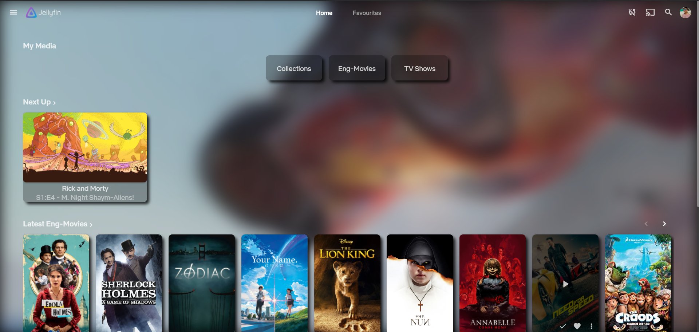
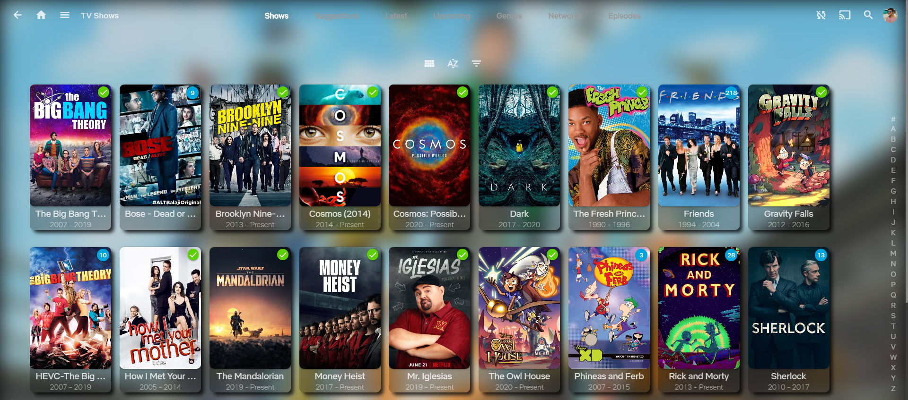
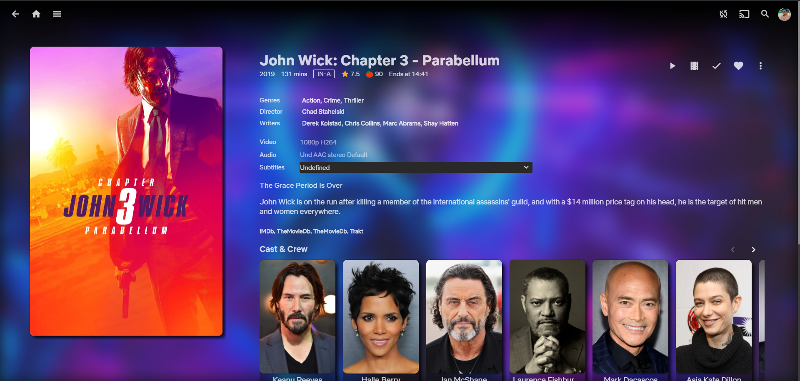
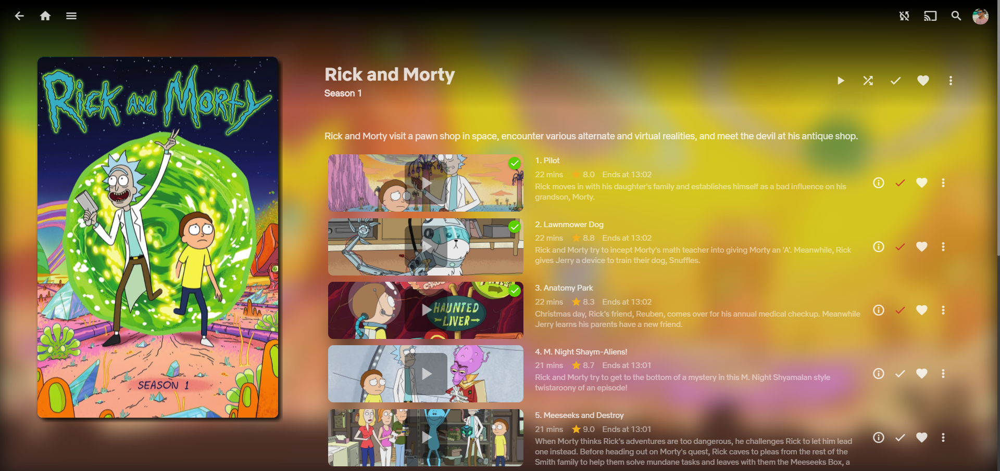
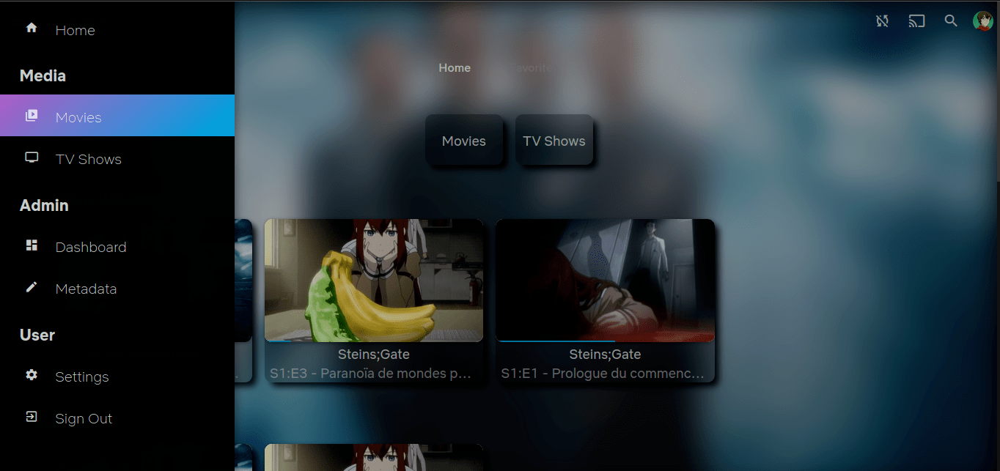
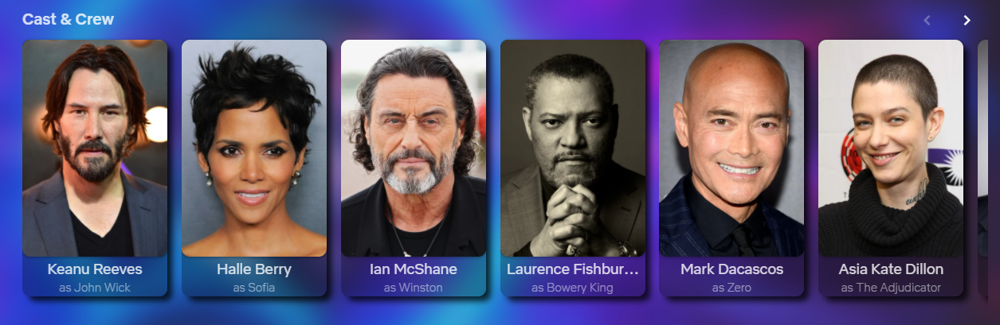

<h1>Jellyfin CustomCSS</h1>
<h4>Warning: This css is only for Jellyfin 10.6.X. </h4>
   

Jellyfin CustomCSS is a custom theme for jellyfin,  Netflix Sans are used as the default fonts but if it is not applied in every area then please make a new issue.

To use the theme copy paste everything from the link below into "Dashboard>General>Custom CSS" and click save, it will apply immediately server-wide to all users on top of any theme they may be using. To remove the theme, clear the "Custom CSS" field and then click 
save.

<a href="https://raw.githubusercontent.com/prayag17/JellyfinCSS/master/JellyfinCUSTOM.css">Copy everything</a>

Home:

Movies/TV:

Title:

Season Episode list:

Gradient hover buttons: 

Cast info:

Custom button animations:
 

<b>and more</b>

